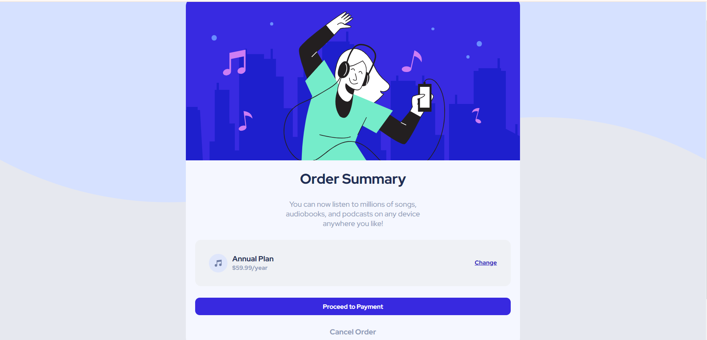
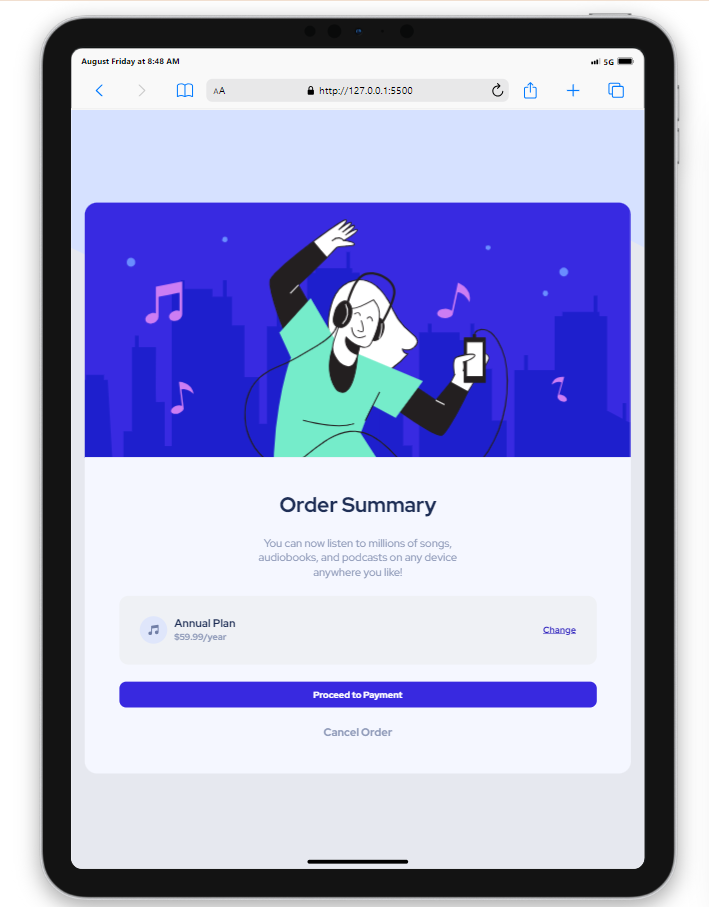

# Frontend Mentor - Order summary card solution

This is a solution to the [Order summary card challenge on Frontend Mentor](https://www.frontendmentor.io/challenges/order-summary-component-QlPmajDUj). Frontend Mentor challenges help you improve your coding skills by building realistic projects.

## Table of contents

- [Overview](#overview)
  - [The challenge](#the-challenge)
  - [Screenshot](#screenshot)
  - [Links](#links)
- [My process](#my-process)
  - [Built with](#built-with)
  - [What I learned](#what-i-learned)
  - [Continued development](#continued-development)
- [Author](#author)
- [Acknowledgments](#acknowledgments)

## Overview

### The challenge

Users should be able to:

- See hover states for interactive elements

### Screenshot





### Links

- Solution URL: [Add solution URL here](https://your-solution-url.com)
- Live Site URL: [Add live site URL here](https://your-live-site-url.com)

## My process

### Built with

- Semantic HTML5 markup
- CSS custom properties
- Flexbox

### What I learned

Well, I was able to learn the correct hierachy when styling interactive elements when working on this project.

```css
input[type="button"]:hover {
  background-color: hsl(245, 75%, 70%);
}
input[type="button"]:active {
  background-color: hsl(252, 100%, 77%);
}
```

### Continued development

I am still going to focus on html and css and flexbox for now.

## Author

- Frontend Mentor - [@notobd](https://www.frontendmentor.io/profile/notobd)

## Acknowledgments

Of course I can't leave without giving shoutout to Favour who has been a huge source of inspiration.
